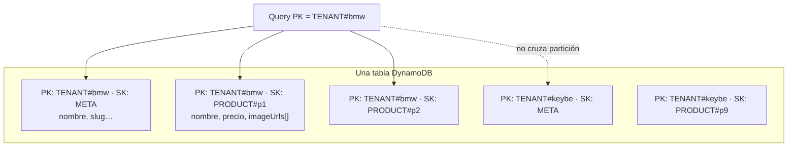
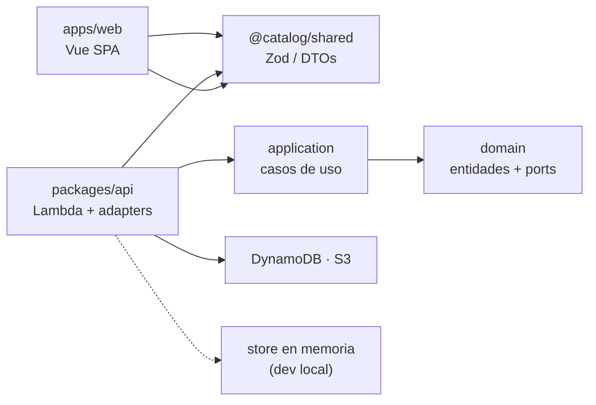
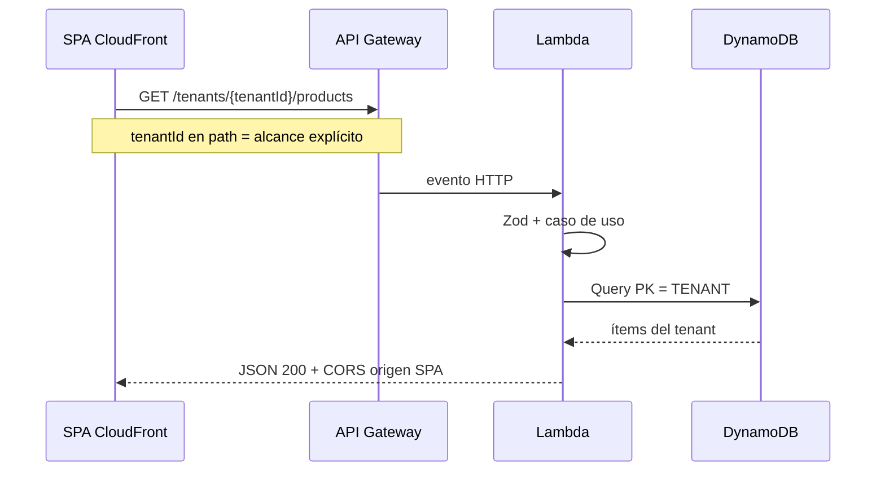
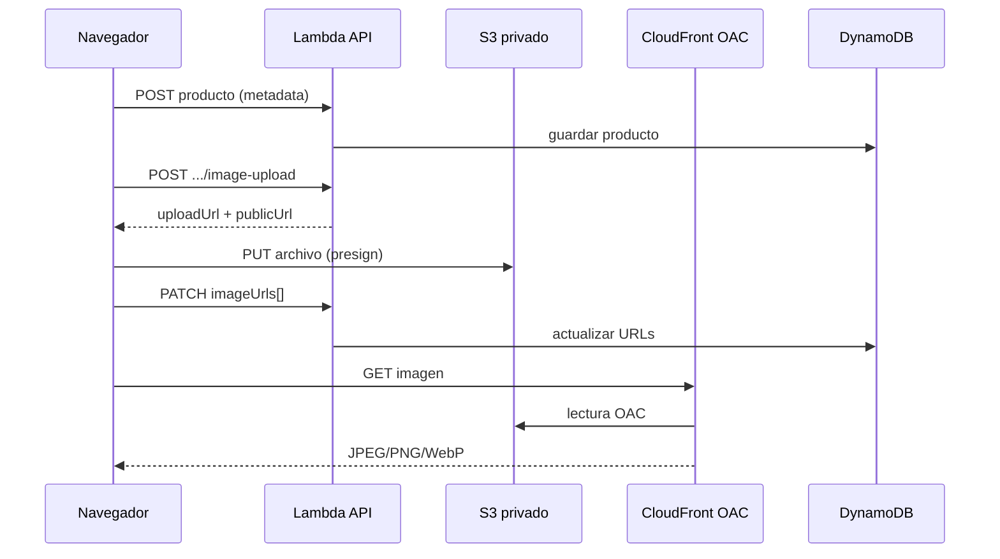
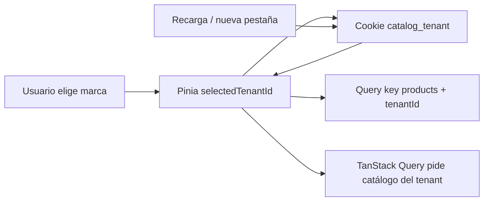
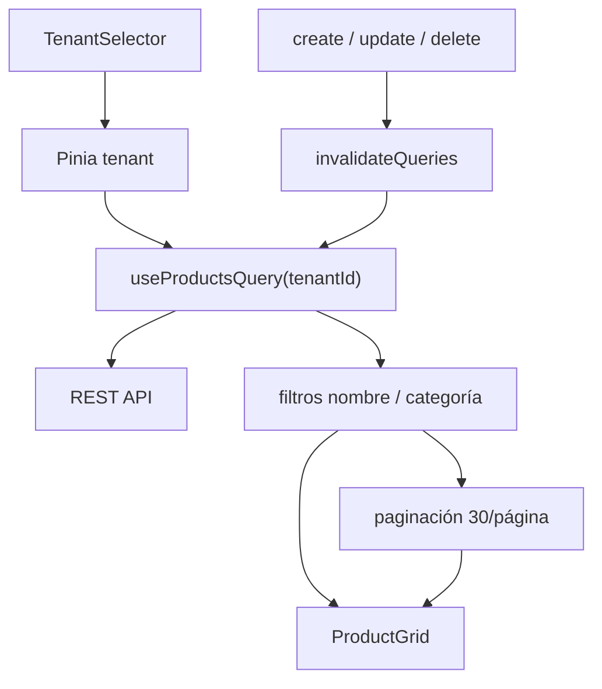
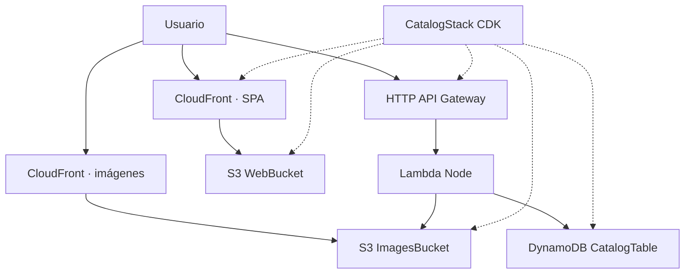

# Multi-tenant product catalog

Catálogo de productos multi-marca: Vue 3 contra una API serverless real en AWS.

## URLs

| | |
|--|--|
| Frontend | https://daq2o95hh6swe.cloudfront.net |
| API | https://ynnkakaim7.execute-api.us-east-2.amazonaws.com |

Región **us-east-2** (limitación de la cuenta de prueba; CloudFront es global).

---

## Cómo está organizado el proyecto

Monorepo con **npm workspaces**. La idea es separar dominio de infraestructura: el frontend y los casos de uso no importan tipos de AWS.

```
multi-tenant-product-catalog/
├── apps/web/                 # SPA Vue 3 (Vite, Pinia, TanStack Query, Tailwind)
│   └── src/
│       ├── api/              # cliente HTTP hacia la API
│       ├── components/       # grid, filtros, selector de marca, etc.
│       ├── composables/      # queries y filtros
│       ├── stores/           # tenant seleccionado (Pinia)
│       ├── styles/tokens.css # diseño (colores Keybe-inspired)
│       └── views/            # catálogo, detalle, formulario
├── packages/
│   ├── domain/               # entidades y puertos (sin AWS)
│   ├── application/          # casos de uso + seed de marcas demo
│   ├── shared/               # DTOs y validación Zod
│   └── api/                  # Lambda, adaptadores Dynamo/S3, servidor local
│       └── src/
│           ├── handlers/     # entrada HTTP
│           └── adapters/     # DynamoDB, S3, store en memoria (dev)
├── infra/                    # CDK (TypeScript)
│   └── lib/catalog-stack.ts  # tabla, buckets, API, CloudFront
├── openspec/                 # especificación del cambio foundation (decisiones)
└── documentation/            # enunciado de la prueba
```

Flujo de dependencias (Clean Architecture):

```text
apps/web  →  packages/shared (Zod)
packages/api  →  application  →  domain
infra (CDK) cablea ARNs y permisos; no mete lógica de negocio
```

En local, `npm run dev:api` levanta la API con **store en memoria** para trabajar la UI sin AWS. En producción, el mismo handler usa DynamoDB y S3.

**Desarrollo local**

```bash
npm install
npm run dev:api          # terminal 1 — API en http://localhost:3000
cp apps/web/.env.example apps/web/.env
npm run dev              # terminal 2 — http://127.0.0.1:5173
```

Scripts útiles: `npm run build`, `npm run test` (Vitest en `apps/web`), `npm run cdk -- synth` desde `infra/`.

---

## Cómo se despliega

### Automático (push a `main`)

Hay un workflow en [`.github/workflows/deploy.yml`](.github/workflows/deploy.yml) pensado para iterar rápido en la cuenta de prueba:

1. GitHub Actions se autentica con **Secrets** `AWS_ACCESS_KEY_ID` / `AWS_SECRET_ACCESS_KEY` (el rol OIDC `GitHubCatalogDeployRole` está en CDK, pero en esta cuenta `AssumeRoleWithWebIdentity` quedó denegado; las keys ya desplegaban bien).
2. Lee `ApiUrl` del stack `CatalogStack`.
3. Build del SPA con esa URL.
4. `cdk deploy CatalogStack` en `us-east-2`.

En GitHub → **Settings → Actions** necesitas:

- **Variables:** `AWS_ACCOUNT_ID`
- **Secrets:** `AWS_ACCESS_KEY_ID`, `AWS_SECRET_ACCESS_KEY`

**(Opcional) OIDC** — si más adelante el trust del rol funciona, puedes cambiar el step de credenciales a `role-to-assume: ${{ vars.AWS_DEPLOY_ROLE_ARN }}` con `permissions.id-token: write`. Bootstrap del stack:

```bash
export AWS_REGION=us-east-2 AWS_DEFAULT_REGION=us-east-2
cd infra
npx cdk deploy GitHubOidcStack --require-approval never
```

Copia el output `GitHubDeployRoleArn` a la variable `AWS_DEPLOY_ROLE_ARN`.

### Manual

```bash
export AWS_REGION=us-east-2 AWS_DEFAULT_REGION=us-east-2
npm run build
cd infra && npx cdk deploy CatalogStack --require-approval never
# con la ApiUrl del output:
VITE_API_URL=<ApiUrl> npm run build -w @catalog/web
cd infra && npx cdk deploy CatalogStack --require-approval never
```

Nunca se suben credenciales al repositorio: perfil local, `aws login` o Secrets de GitHub Actions (nunca en el código).

---

## Decisiones técnicas

**Aislamiento multi-tenant (DynamoDB, una tabla)**  
Modelé todo en una sola tabla con `PK = TENANT#{tenantId}` y `SK` de metadata o `PRODUCT#{id}`. Lo hice así porque cada listado o lectura parte de la partición del tenant: el aislamiento no depende de un `WHERE` que alguien pueda olvidar en un endpoint nuevo, y actualizar o borrar exige `PK` + `SK`, no solo un id de producto. Descarté una tabla por marca (mucho operativo para una prueba) y filtrar tenant solo con GSI (más fácil equivocarse). No metí Cognito: el enunciado pide demostrar aislamiento de datos, no autenticación; hoy cualquiera puede llamar la API con un `tenantId` válido.



**Capas (dominio → casos de uso → adaptadores)**  
Separé entidades y puertos en `domain`, la lógica en `application` y Dynamo/S3/Lambda en `api`, con Zod compartido. La Lambda solo traduce HTTP → caso de uso → JSON. Así el mismo CRUD corre en local con un store en memoria y en AWS sin duplicar reglas de negocio, y el frontend nunca toca el SDK de AWS.



**API REST**  
Puse el tenant en la ruta (`/tenants/{tenantId}/products/...`) para que el alcance sea explícito en cada request y la API sea predecible sin documentación extra. Valido path params y body con Zod, rechazo JSON malformado con 400, exijo `contentLength` ≤ 5 MiB en el presign (sin firmar `Content-Length` en el PUT — eso rompe la subida desde el navegador), devuelvo errores con `code` y `message`, y CORS limitado al origen del SPA en CloudFront — el brief pide criterio propio y CORS bien resuelto.



**Imágenes (requisito abierto del enunciado)**  
El brief deja libertad en cómo persistir y servir imágenes en serverless; esta fue mi respuesta. No guardo bytes en DynamoDB (límites de ítem, coste y mala idea para archivos). El flujo es: crear el producto → `POST .../image-upload` obtiene un PUT firmado a S3 → el navegador sube directo al bucket **privado** → `PATCH` con la URL pública. Las descargas pasan por **CloudFront con OAC**, no por un bucket público. En DynamoDB solo quedan URLs en `imageUrls[]`. Subir desde el cliente evita pasar el archivo por Lambda (timeouts y payload). Limito a JPEG/PNG/WebP y ~5 MB en el presign. La UI exige al menos una imagen antes de dar por cerrado el alta, como pide la prueba.



**Cookie para recordar la marca**  
El frontend debe usar cookies con buenas prácticas para recordar la marca seleccionada. Uso `catalog_tenant` con el `tenantId`, `Path=/`, 30 días, `SameSite=Lax` y `Secure` en producción (`Secure` desactivado en localhost). No la marqué `HttpOnly` porque el SPA necesita leerla al cargar para restaurar Pinia y la clave de TanStack Query `['products', tenantId]` sin un round-trip extra; es el trade-off habitual en SPAs sin sesión de servidor. La preferencia no es secreto de seguridad — solo UX.



**Frontend y estado**  
Vue 3 + TypeScript, URL de API por `VITE_API_URL`. Pinia para la marca activa; TanStack Query para datos remotos y para que la lista se refresque sola tras crear/editar/borrar. El selector incluye **“Todas (solo lectura)”**: es una vista agregada del portafolio para comparar marcas sin mezclar escritura — el CRUD solo se habilita al elegir un tenant concreto, y cada request de mutación sigue yendo a `/tenants/{tenantId}/…` (el aislamiento de datos no cambia). Los filtros por nombre y categoría y la paginación (30 por página) los resolví en cliente: con el volumen actual del demo cumple el extra del brief sin GSI ni búsqueda server-side (la evolución a escala la dejo en “Qué mejoraría”). Tailwind con tokens en `tokens.css` para no dispersar estilos.



**Infra serverless (CDK)**  
Todo el aprovisionamiento va en CDK TypeScript, como exige la prueba — nada crítico hecho a mano en consola. Un solo `CatalogStack` (HTTP API + Lambda, Dynamo on-demand, S3 imágenes + hosting SPA, CloudFront) me alcanza para el tamaño del ejercicio; al crecer separaría datos, API y web. El seed de marcas (con una imagen demo por producto vía URL pública) corre en el primer acceso a la API si la tabla está vacía, para demostrar el cambio de catálogo sin hardcodear productos en el frontend.



---

## Qué mejoraría con más tiempo

La prueba pide un catálogo multi-marca operativo; con el alcance actual eso se cumple. Si esto fuera un producto con ambición de crecer —un showroom de verdad, en la línea de un marketplace— haría decisiones de arquitectura distintas (servicios acotados, eventos, búsqueda dedicada, colas) y sumaría capas de experiencia y confianza que hoy están fuera de scope.

### Cimientos que faltan en esta versión

- **Roles y permisos:** separar administradores (CRUD, inventario, precios) de visitantes en modo showroom, con autorización en API y UI.
- **CI/CD:** el pipeline actual es deliberadamente simple para validar deploys en la cuenta de prueba; lo llevaría a un flujo con lint, tests y build en PR, deploy a producción solo tras merge y comprobaciones post-deploy.
- **Catálogo a escala:** paginación por cursor, búsqueda y filtros en la API (p. ej. GSI por categoría) en lugar de cargar todo el listado en el cliente.
- **CDN:** caché en CloudFront para imágenes e invalidaciones más finas del SPA en cada release (assets con hash, no `index.html` entero).
- **Medios enriquecidos:** galería con varias imágenes por producto y, donde tenga sentido, video (presign, transcodificación o streaming).

### Si el catálogo fuera un showroom comercial

Pensando en algo comparable a un marketplace (descubrimiento, confianza y cierre de compra), añadiría entre otras:

- **Marca blanca (white-label):** dominio, logo, colores y copy por cliente para que cada empresa despliegue su propio showroom bajo su identidad, para comercializar la plataforma como SaaS a retailers y marcas sin que parezca un producto genérico de terceros.
- **Inventario y variantes** (talla, color, SKU), stock en tiempo real y reglas de precio (ofertas, bundles).
- **Valoraciones y reseñas** verificadas por compra, con moderación por tenant.
- **Perfil de vendedor o marca**, políticas de envío/devolución y FAQs por tenant.
- **Carrito, checkout y pasarelas de pago** (en un ecosistema BIKY encajaría con algo tipo [BIKY Pay](https://biky.ai/es/plataforma-de-ventas-con-ia/payments-biky-pay/): pago dentro del flujo de venta).
- **Chat con asesores humanos** y handoff cuando la IA no alcanza; historial unificado por cliente.
- **Tracking de envíos** (integración con transportadoras, estados y notificaciones).
- **Búsqueda avanzada**, comparador, lista de deseos, carrito, alertas de precio y analítica de conversión por producto y canal.
- **Resiliencia y picos de tráfico:** hoy el backend es serverless (Lambda + API Gateway), que escala solo en rangos razonables; con tráfico sostenido o picos agresivos añadiría **gestión de carga y alta disponibilidad** — por ejemplo **Kubernetes (EKS)** o **ECS/Fargate** detrás de un **ALB** con autoscaling, health checks y despliegues graduales (rolling/canary), más **rate limiting**, colas (**SQS**) para trabajo asíncrono y **caché** (ElastiCache/API Gateway throttling) para no tumbar el catálogo ni la API en campañas o Black Friday.

### Alineación con BIKY (catálogo conversacional + IA)

[BIKY](https://biky.ai/es/) no trata el catálogo como un PDF estático: en su módulo [Catalog](https://biky.ai/es/plataforma-de-ventas-con-ia/catalogo-conversacional/) productos, inventario y ofertas viven en un solo lugar para **cotizar y vender sin fricción**, conectado al resto de la plataforma (conversación, CRM, pagos). En esa dirección integraría este frontend con:

- Un **asistente de ventas con IA** (Vendedores IA / Smart Chat): que entienda intención, contexto y tono —la propuesta de *Inteligencia Artificial Emocional* de BIKY—, responda 24/7 sobre el catálogo del tenant, recomiende productos, arme cotizaciones y deje el hilo listo en CRM sin que el cliente repita datos.
- **Catálogo como fuente de verdad** para el agente: mismos SKUs, precios y stock que ve el usuario en el showroom, para evitar alucinaciones y mantener la precisión que la plataforma promete en operación comercial.
- **Omnicanal** (web, WhatsApp, webchat): la ficha del producto y el detalle del catálogo alimentan el mismo flujo conversacional que ya usan marcas en retail y automotriz en BIKY.

Eso convertiría el ejercicio técnico en una pieza del embudo comercial —*convertir preguntas en ventas*— en vez de una vitrina aislada.

